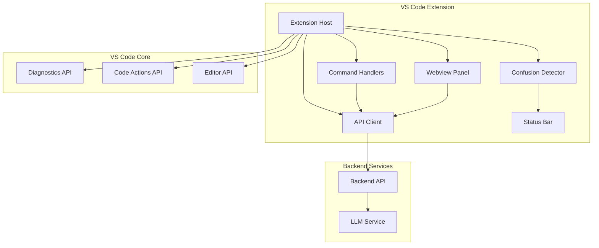

# Design Document: Code Coach VS Code Extension

## Overview

Code Coach is a VS Code extension that transforms the coding experience from "making it work" to "understanding how it works." The extension integrates seamlessly into the VS Code editor, providing contextual explanations, error analysis, and code quality reviews through an AI-powered backend service.

The architecture follows a clean separation between the VS Code client (handling UI, events, and user interactions) and a backend API service (processing code and generating explanations). The extension uses VS Code's webview API for rich teaching interfaces and integrates with the existing diagnostic and code action systems.

## Architecture

### High-Level Architecture



### Component Interaction Flow

1. **User Interaction**: User selects code or encounters error
2. **Command Processing**: Extension captures context and user intent
3. **API Communication**: Structured request sent to backend with code context
4. **Response Processing**: Backend returns structured explanation data
5. **UI Rendering**: Webview panel displays teaching-oriented content
6. **Feedback Loop**: User feedback collected for continuous improvement

## Components and Interfaces

### Extension Host (extension.ts)

**Responsibilities:**
- Extension lifecycle management (activate/deactivate)
- Command registration and routing
- Component initialization and dependency injection
- Configuration management

**Key Interfaces:**
```typescript
interface ExtensionContext {
  subscriptions: Disposable[];
  globalState: Memento;
  workspaceState: Memento;
}

interface CodeCoachConfig {
  apiBaseUrl: string;
  apiKey: string;
  telemetryEnabled: boolean;
  userLevel: 'beginner' | 'intermediate';
}
```

### Command Handlers

**Core Commands:**
- `codeCoach.explainSelection`: Explains selected or contextual code
- `codeCoach.reviewSelection`: Provides code quality analysis
- `codeCoach.explainError`: Analyzes and explains diagnostics

**Selection Logic:**
- If text selected: Use selection range
- If no selection: Expand to current logical block (function, class, or statement)
- Context gathering: Include surrounding lines for better understanding

### API Client (CodeCoachApiClient.ts)

**Interface Design:**
```typescript
interface ApiClient {
  explainSelection(request: ExplainRequest): Promise<ExplanationResponse>;
  reviewSelection(request: ReviewRequest): Promise<ReviewResponse>;
  explainError(request: ErrorRequest): Promise<ErrorResponse>;
  logEvent(event: TelemetryEvent): Promise<void>;
}

interface ExplainRequest {
  code: string;
  languageId: string;
  filePath?: string;
  surroundingContext?: string;
  userLevel?: string;
}

interface ExplanationResponse {
  type: 'explain';
  summary: string;
  lineByLine: LineExplanation[];
  pitfalls: string[];
  tryItYourself?: string;
}
```

**Error Handling:**
- Network timeouts with graceful degradation
- API rate limiting with user feedback
- Malformed response validation and fallbacks

### Webview Panel (CodeCoachPanel.ts)

**UI Architecture:**
- Single sidebar webview for all explanation types
- Message-based communication between extension and webview
- Responsive layout with clear information hierarchy

**Content Sections:**
1. **Context Header**: File name, operation type, code snippet
2. **Main Content**: Explanations, reviews, or error analysis
3. **Interactive Elements**: Feedback controls, follow-up actions
4. **Learning Aids**: "Try it yourself" suggestions, related concepts

**State Management:**
```typescript
interface PanelState {
  currentExplanation?: ExplanationData;
  history: ExplanationData[];
  userFeedback: FeedbackEvent[];
}
```

### Confusion Detector (ConfusionDetector.ts)

**Detection Heuristics:**
- **Cursor Dwell Time**: Track time spent on lines with diagnostics
- **Repeated Errors**: Identify recurring diagnostic patterns
- **Edit Patterns**: Detect rapid edit-undo cycles indicating confusion

**Notification Strategy:**
- Non-intrusive status bar notifications
- Cooldown periods to prevent notification fatigue
- User preference respect for proactive suggestions

**Implementation:**
```typescript
interface ConfusionMetrics {
  dwellTime: number;
  errorRepeatCount: number;
  editCycleCount: number;
  lastNotificationTime: number;
}
```

### Telemetry System (Telemetry.ts)

**Data Collection (Anonymous):**
- Command usage frequency and patterns
- Error types and explanation requests
- User feedback on explanation quality
- Performance metrics (response times, success rates)

**Privacy Compliance:**
- Explicit opt-in/opt-out controls
- No code content or personal information collected
- Aggregated metrics only for service improvement

## Data Models

### Request/Response Schemas

**Explanation Request:**
```typescript
interface ExplainRequest {
  code: string;              // Selected code snippet
  languageId: string;        // VS Code language identifier
  filePath?: string;         // File context for better analysis
  surroundingContext?: string; // Lines before/after selection
  userLevel?: 'beginner' | 'intermediate';
}
```

**Error Analysis Request:**
```typescript
interface ErrorRequest {
  code: string;              // Code containing the error
  errorMessage: string;      // Diagnostic message
  errorRange: Range;         // Error location
  diagnosticCode?: string;   // Error code if available
  languageId: string;
  userLevel?: string;
}
```

**Review Request:**
```typescript
interface ReviewRequest {
  code: string;
  languageId: string;
  filePath?: string;
  reviewType: 'quality' | 'style' | 'performance';
  userLevel?: string;
}
```

### Response Formats

**Structured Explanation:**
```typescript
interface ExplanationResponse {
  type: 'explain' | 'error' | 'review';
  summary: string;           // Plain English overview
  lineByLine: LineExplanation[]; // Detailed line analysis
  pitfalls?: string[];       // Common mistakes to avoid
  improvements?: Improvement[]; // For review responses
  tryItYourself?: string;    // Learning exercise
  relatedConcepts?: string[]; // Additional learning topics
}

interface LineExplanation {
  lineOffset: number;        // Relative to selection start
  code: string;             // The actual code line
  explanation: string;      // What this line does
}

interface Improvement {
  description: string;      // What to improve
  improvedCode?: string;    // Suggested better version
  reasoning: string;        // Why it's better
}
```

## Correctness Properties

*A property is a characteristic or behavior that should hold true across all valid executions of a system—essentially, a formal statement about what the system should do. Properties serve as the bridge between human-readable specifications and machine-verifiable correctness guarantees.*

### Property 1: Code Explanation Workflow Completeness
*For any* valid Python code selection and explain command trigger, the extension should send the code to the Backend API with proper context and display a structured explanation containing all required sections (line-by-line, summary, pitfalls).
**Validates: Requirements 1.1, 1.3, 1.4**

### Property 2: Automatic Selection Expansion
*For any* cursor position in a Python file when no text is selected, triggering the explain command should automatically expand the selection to include the current line plus meaningful surrounding context.
**Validates: Requirements 1.2**

### Property 3: Python-Only Activation
*For any* file opened in VS Code, the extension should only activate when the file language is Python, remaining inactive for all other file types.
**Validates: Requirements 1.5**

### Property 4: Error Explanation Workflow
*For any* Python file containing diagnostics, requesting error explanation should gather complete error context (message, range, surrounding code) and display structured error analysis with meaning, cause, and fix information.
**Validates: Requirements 2.1, 2.2**

### Property 5: Code Action Integration
*For any* line in a Python file containing diagnostics, the extension should offer a code action to explain the error, prioritizing the most relevant diagnostic when multiple exist.
**Validates: Requirements 2.3, 2.5**

### Property 6: File Modification Safety
*For any* extension operation (explain, review, error analysis), the extension should never modify the user's source files, only providing explanations and suggestions in the UI.
**Validates: Requirements 2.4, 3.5**

### Property 7: Code Review Completeness
*For any* code selection and review request, the extension should analyze the code and display a complete review containing what's good, what could be improved, suggested improvements, and explanations of why improvements are better.
**Validates: Requirements 3.1, 3.2, 3.3**

### Property 8: Confusion Detection Timing
*For any* cursor position on a line with diagnostics, if the cursor remains there for more than 15 seconds, the Confusion Detector should offer help via non-intrusive status bar notification, respecting cooldown periods to prevent spam.
**Validates: Requirements 4.1, 4.4**

### Property 9: Repeated Error Detection
*For any* diagnostic that appears repeatedly in the same location within a short time period, the Confusion Detector should suggest using Code Coach to understand the error.
**Validates: Requirements 4.2**

### Property 10: Configuration Respect
*For any* user preference setting (proactive suggestions, telemetry, skill level), the extension should modify its behavior according to the configuration value and include relevant settings in API requests.
**Validates: Requirements 4.5, 6.2, 7.1**

### Property 11: Command Accessibility
*For any* active extension state, all core commands (explain, review, error analysis) should be accessible through both the command palette and appropriate context menus.
**Validates: Requirements 5.1**

### Property 12: Feedback Mechanism Presence
*For any* explanation, review, or error analysis displayed in the webview, feedback controls should be present to allow users to rate the helpfulness of the response.
**Validates: Requirements 5.3**

### Property 13: VS Code Integration Compliance
*For any* extension operation, the extension should properly integrate with VS Code's diagnostic and code action systems without interfering with other extensions or core functionality.
**Validates: Requirements 5.4**

### Property 14: Performance Non-Blocking
*For any* API call made by the extension, the VS Code editor should remain responsive and not block user interactions during the request/response cycle.
**Validates: Requirements 5.5**

### Property 15: Configuration System Integration
*For any* configuration option (API endpoint, authentication, skill level, telemetry), the extension should store and retrieve values using VS Code's standard settings system and validate configuration with helpful error messages for invalid values.
**Validates: Requirements 6.1, 6.4, 6.5**

### Property 16: Privacy-Compliant Telemetry
*For any* telemetry event, if telemetry is enabled, the extension should collect only anonymous usage data without including code content, personal information, or sensitive details in error messages.
**Validates: Requirements 7.2, 7.4**

### Property 17: Telemetry Event Completeness
*For any* user action (explanation request, error analysis, review request, feedback), if telemetry is enabled, appropriate anonymous events should be tracked to improve the service.
**Validates: Requirements 7.3**

### Property 18: API Communication Protocol
*For any* API request (explain, review, error), the extension should communicate using the correct HTTP endpoints with well-structured payloads containing all necessary context (code, language, file path, user preferences).
**Validates: Requirements 8.1, 8.2**

### Property 19: Error Resilience
*For any* API failure condition (timeout, network error, malformed response), the extension should handle the error gracefully with appropriate fallback behavior and user-friendly error messages.
**Validates: Requirements 8.3, 8.5**

## Error Handling

### API Communication Errors

**Network Failures:**
- Implement exponential backoff for transient failures
- Provide clear user feedback for persistent connectivity issues
- Cache recent explanations for offline reference when possible

**Authentication Errors:**
- Validate API keys on extension activation
- Provide clear guidance for API key configuration
- Handle expired or invalid credentials gracefully

**Rate Limiting:**
- Respect API rate limits with appropriate delays
- Queue requests during high usage periods
- Inform users of rate limit status when relevant

### Extension Runtime Errors

**Webview Failures:**
- Implement fallback text-based explanations if webview fails to load
- Handle webview disposal and recreation gracefully
- Validate all message passing between extension and webview

**Configuration Errors:**
- Validate all configuration values on change
- Provide specific error messages for invalid settings
- Use sensible defaults when configuration is missing

**File System Errors:**
- Handle file access permissions gracefully
- Manage temporary files and cleanup properly
- Validate file paths and handle non-existent files

### User Experience Error Handling

**Graceful Degradation:**
- Continue core functionality even when optional features fail
- Provide alternative workflows when primary paths are unavailable
- Maintain extension stability during partial failures

**Error Communication:**
- Use VS Code's notification system for user-facing errors
- Provide actionable error messages with suggested solutions
- Log detailed error information for debugging without exposing sensitive data

## Testing Strategy

### Dual Testing Approach

The extension will use both unit testing and property-based testing to ensure comprehensive coverage and correctness:

**Unit Tests:**
- Test specific examples and edge cases for each component
- Verify integration points between VS Code APIs and extension code
- Test error conditions and boundary cases
- Focus on concrete scenarios and known problematic inputs

**Property-Based Tests:**
- Verify universal properties across all possible inputs using fast-check library
- Test correctness properties with minimum 100 iterations per test
- Generate random code snippets, configurations, and user interactions
- Validate that core behaviors hold across the entire input space

### Property-Based Testing Configuration

**Library Selection:** fast-check for TypeScript/JavaScript property-based testing
- Mature library with excellent VS Code extension compatibility
- Rich set of generators for strings, objects, and custom data types
- Built-in shrinking capabilities for minimal counterexamples

**Test Configuration:**
- Minimum 100 iterations per property test to ensure thorough coverage
- Custom generators for VS Code-specific data types (ranges, diagnostics, documents)
- Seed-based reproducible test runs for consistent CI/CD results

**Property Test Tagging:**
Each property-based test must include a comment linking it to the design document:
```typescript
// Feature: code-coach-vscode, Property 1: Code Explanation Workflow Completeness
```

### Testing Architecture

**Test Structure:**
```
tests/
├── unit/                    # Traditional unit tests
│   ├── commands/           # Command handler tests
│   ├── api/               # API client tests
│   ├── panel/             # Webview panel tests
│   └── confusion/         # Confusion detector tests
├── property/              # Property-based tests
│   ├── workflow.test.ts   # Core workflow properties
│   ├── safety.test.ts     # Safety and security properties
│   └── integration.test.ts # VS Code integration properties
└── fixtures/              # Test data and mocks
    ├── code-samples/      # Sample Python code for testing
    ├── api-responses/     # Mock API response data
    └── configurations/    # Test configuration scenarios
```

**Mock Strategy:**
- Mock VS Code APIs for isolated unit testing
- Use real HTTP clients with mock servers for API testing
- Create realistic test data that represents actual usage patterns

**Integration Testing:**
- Test extension activation and deactivation cycles
- Verify command registration and execution
- Test webview creation and message passing
- Validate configuration loading and validation

### Continuous Integration

**Automated Testing:**
- Run full test suite on every commit
- Property-based tests with fixed seeds for reproducibility
- Performance regression testing for API response times
- Cross-platform testing (Windows, macOS, Linux)

**Quality Gates:**
- 90% code coverage minimum for unit tests
- All property-based tests must pass with 100 iterations
- No failing tests allowed in main branch
- Performance benchmarks must not regress by more than 10%

**Test Data Management:**
- Generate realistic test scenarios from actual usage patterns
- Maintain test data privacy by using synthetic code examples
- Regular test data refresh to catch evolving edge cases