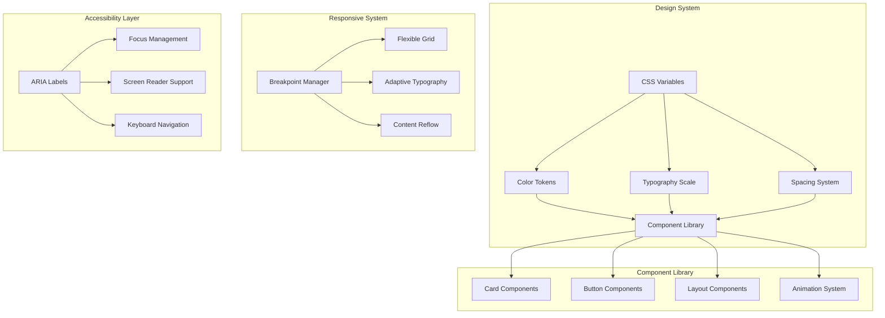

# Design Document: Modern Sidebar for Code Coach

## Overview

The Modern Sidebar transforms the existing Code Coach webview panel into a contemporary, polished interface that feels native to VS Code while enhancing user experience through thoughtful design patterns. The design emphasizes visual hierarchy, smooth interactions, and accessibility while maintaining the core teaching functionality.

The modernization focuses on creating a cohesive design system with consistent components, implementing responsive layouts that adapt to different sidebar widths, adding subtle animations and micro-interactions, and ensuring full accessibility compliance. The design leverages VS Code's native CSS variables and design language to create seamless integration.

## Architecture

### Design System Architecture



### Component Hierarchy

The modern sidebar follows a clear component hierarchy that ensures consistency and maintainability:

1. **Layout Container**: Root container with responsive behavior
2. **Header Section**: Branding and context information
3. **Content Cards**: Modular content sections with consistent styling
4. **Interactive Elements**: Buttons, inputs, and feedback controls
5. **Animation Layer**: Smooth transitions and micro-interactions

## Components and Interfaces

### Design Token System

**CSS Custom Properties Structure:**
```css
:root {
  /* Spacing Scale */
  --spacing-xs: 4px;
  --spacing-sm: 8px;
  --spacing-md: 16px;
  --spacing-lg: 24px;
  --spacing-xl: 32px;
  
  /* Typography Scale */
  --text-xs: 11px;
  --text-sm: 12px;
  --text-base: 13px;
  --text-lg: 14px;
  --text-xl: 16px;
  
  /* Border Radius */
  --radius-sm: 4px;
  --radius-md: 6px;
  --radius-lg: 8px;
  
  /* Animation Timing */
  --duration-fast: 150ms;
  --duration-normal: 250ms;
  --duration-slow: 350ms;
  
  /* Easing Functions */
  --ease-out: cubic-bezier(0.16, 1, 0.3, 1);
  --ease-in-out: cubic-bezier(0.4, 0, 0.2, 1);
}
```

### Card Component System

**Base Card Structure:**
```css
.modern-card {
  background: var(--vscode-sideBar-background);
  border: 1px solid var(--vscode-panel-border);
  border-radius: var(--radius-md);
  padding: var(--spacing-lg);
  margin-bottom: var(--spacing-md);
  transition: all var(--duration-normal) var(--ease-out);
}

.modern-card:hover {
  border-color: var(--vscode-focusBorder);
  box-shadow: 0 2px 8px rgba(0, 0, 0, 0.1);
  transform: translateY(-1px);
}
```

**Card Variants:**
- **Summary Card**: Primary content with emphasis styling
- **Code Card**: Syntax-highlighted code blocks with line numbers
- **Error Card**: Error states with appropriate color coding
- **Feedback Card**: Interactive elements for user input

### Responsive Layout System

**Flexible Grid Implementation:**
```css
.sidebar-grid {
  display: grid;
  gap: var(--spacing-md);
  grid-template-columns: 1fr;
}

@container sidebar (min-width: 300px) {
  .sidebar-grid {
    gap: var(--spacing-lg);
  }
}

@container sidebar (min-width: 400px) {
  .two-column {
    grid-template-columns: 1fr 1fr;
  }
}
```

**Adaptive Typography:**
```css
.adaptive-text {
  font-size: clamp(var(--text-sm), 2.5vw, var(--text-base));
  line-height: 1.5;
}

.heading-adaptive {
  font-size: clamp(var(--text-base), 3vw, var(--text-lg));
  font-weight: 600;
  line-height: 1.3;
}
```

### Animation System

**Micro-interaction Patterns:**
```css
/* Button Interactions */
.modern-button {
  transition: all var(--duration-fast) var(--ease-out);
  transform: scale(1);
}

.modern-button:hover {
  transform: scale(1.02);
  background: var(--vscode-button-hoverBackground);
}

.modern-button:active {
  transform: scale(0.98);
  transition-duration: 50ms;
}

/* Content Reveal Animations */
.fade-in {
  animation: fadeIn var(--duration-normal) var(--ease-out);
}

@keyframes fadeIn {
  from {
    opacity: 0;
    transform: translateY(8px);
  }
  to {
    opacity: 1;
    transform: translateY(0);
  }
}

/* Loading States */
.skeleton {
  background: linear-gradient(
    90deg,
    var(--vscode-textBlockQuote-background) 25%,
    var(--vscode-sideBar-background) 50%,
    var(--vscode-textBlockQuote-background) 75%
  );
  background-size: 200% 100%;
  animation: shimmer 1.5s infinite;
}

@keyframes shimmer {
  0% { background-position: -200% 0; }
  100% { background-position: 200% 0; }
}
```

## Data Models

### Component State Management

**Card Component State:**
```typescript
interface CardState {
  isExpanded: boolean;
  isLoading: boolean;
  hasError: boolean;
  animationState: 'idle' | 'entering' | 'exiting';
}

interface CardProps {
  title: string;
  content: string | ReactNode;
  variant: 'default' | 'error' | 'success' | 'warning';
  collapsible?: boolean;
  icon?: string;
}
```

**Animation State Management:**
```typescript
interface AnimationConfig {
  duration: number;
  easing: string;
  delay?: number;
  stagger?: number;
}

interface TransitionState {
  isVisible: boolean;
  isAnimating: boolean;
  direction: 'in' | 'out';
}
```

### Theme Integration

**Theme-Aware Color System:**
```typescript
interface ThemeColors {
  primary: string;
  secondary: string;
  success: string;
  warning: string;
  error: string;
  surface: string;
  onSurface: string;
  border: string;
}

interface ThemeConfig {
  colors: ThemeColors;
  spacing: SpacingScale;
  typography: TypographyScale;
  animations: AnimationConfig;
}
```

## Correctness Properties

*A property is a characteristic or behavior that should hold true across all valid executions of a system—essentially, a formal statement about what the system should do. Properties serve as the bridge between human-readable specifications and machine-verifiable correctness guarantees.*

<function_calls>
<invoke name="prework">
<parameter name="featureName">modern-sidebar

### Property 1: Design System Consistency
*For any* UI component rendered in the Modern Sidebar, it should use the cohesive design system with consistent typography scales, spacing tokens, and color schemes from the defined design system.
**Validates: Requirements 1.1, 1.5**

### Property 2: Theme Adaptation Completeness
*For any* VS Code theme change (dark or light mode), all colors in the Modern Sidebar should automatically adapt using VS Code's native CSS variables and maintain proper contrast ratios of at least 4.5:1.
**Validates: Requirements 1.2, 1.3, 1.4**

### Property 3: Responsive Layout Behavior
*For any* sidebar width change, the responsive layout should automatically adjust content without horizontal scrolling, with grid layouts stacking appropriately on narrow widths and typography remaining readable.
**Validates: Requirements 2.1, 2.3, 2.4**

### Property 4: Content Overflow Handling
*For any* content that exceeds available height or contains long text, the Modern Sidebar should provide smooth vertical scrolling with proper indicators and appropriate line heights for optimal readability.
**Validates: Requirements 2.2, 2.5**

### Property 5: Animation System Consistency
*For any* interactive element or content transition, the animation system should provide smooth transitions with appropriate easing curves, hover feedback, and fade-in animations for new content.
**Validates: Requirements 3.1, 3.2, 3.3, 3.4**

### Property 6: Accessibility Motion Compliance
*For any* animation or transition, when the user has enabled reduced motion preferences, the animation system should respect the prefers-reduced-motion CSS media query and disable or reduce animations accordingly.
**Validates: Requirements 3.5, 7.4**

### Property 7: Content Organization Clarity
*For any* explanation or content display, the Modern Sidebar should use clear section dividers, visual grouping, improved code highlighting with line numbers, and consistent iconography for different content types.
**Validates: Requirements 4.1, 4.2, 4.4**

### Property 8: Interactive Element Consistency
*For any* interactive element (buttons, expandable sections, form elements), the Modern Sidebar should provide consistent styling, clear state indicators, appropriate sizing for easy interaction, and modern design consistent with VS Code.
**Validates: Requirements 4.3, 4.5, 5.1, 5.2, 5.3, 5.5**

### Property 9: Accessibility Standards Compliance
*For any* interactive element or content, the Modern Sidebar should implement proper ARIA labels, semantic HTML structure, clear focus indicators, logical tab order, and minimum 44x44 pixel touch targets.
**Validates: Requirements 5.4, 7.1, 7.2, 7.5**

### Property 10: Loading and Error State Presentation
*For any* API request or error condition, the Modern Sidebar should display appropriate loading indicators with smooth animations, error messages in styled containers with iconography, skeleton screens for layout stability, and retry mechanisms for failures.
**Validates: Requirements 6.1, 6.2, 6.3, 6.4**

### Property 11: Empty State Engagement
*For any* empty state condition, the Modern Sidebar should display engaging illustrations or icons with helpful guidance text to improve user experience.
**Validates: Requirements 6.5**

### Property 12: Color Contrast Accessibility
*For any* text or interactive element, the Modern Sidebar should maintain sufficient color contrast ratios of at least 4.5:1 to meet accessibility standards.
**Validates: Requirements 7.3**

### Property 13: Rendering Performance Optimization
*For any* content rendering or update operation, the Modern Sidebar should use efficient CSS, minimize layout thrashing, implement performance optimizations for large content, and maintain 60fps during animations.
**Validates: Requirements 8.1, 8.2, 8.5**

### Property 14: Asset Loading Efficiency
*For any* initial render or content update, the Modern Sidebar should lazy-load non-critical assets and use efficient DOM manipulation to minimize reflows and repaints.
**Validates: Requirements 8.3, 8.4**

## Error Handling

### Theme Integration Errors

**CSS Variable Fallbacks:**
```css
.modern-component {
  color: var(--vscode-foreground, #cccccc);
  background: var(--vscode-sideBar-background, #252526);
}
```

**Theme Detection Failures:**
- Implement fallback color schemes when VS Code theme variables are unavailable
- Provide graceful degradation to system default colors
- Log theme integration issues for debugging without breaking functionality

### Animation and Performance Errors

**Reduced Motion Handling:**
```css
@media (prefers-reduced-motion: reduce) {
  .modern-sidebar * {
    animation-duration: 0.01ms !important;
    animation-iteration-count: 1 !important;
    transition-duration: 0.01ms !important;
  }
}
```

**Performance Degradation:**
- Monitor frame rates and disable animations if performance drops below 30fps
- Implement progressive enhancement for complex animations
- Provide fallback static states for critical functionality

### Responsive Layout Failures

**Container Query Fallbacks:**
```css
/* Fallback for browsers without container query support */
.sidebar-content {
  display: block;
}

@supports (container-type: inline-size) {
  .sidebar-content {
    container-type: inline-size;
    display: grid;
  }
}
```

**Layout Overflow Protection:**
```css
.content-container {
  overflow-wrap: break-word;
  word-break: break-word;
  min-width: 0;
  max-width: 100%;
}
```

## Testing Strategy

### Dual Testing Approach

The Modern Sidebar will use both unit testing and property-based testing to ensure comprehensive coverage and correctness:

**Unit Tests:**
- Test specific component rendering scenarios and edge cases
- Verify theme switching behavior with known color values
- Test responsive breakpoint behavior at specific widths
- Validate accessibility features with concrete examples

**Property-Based Tests:**
- Verify design system consistency across all possible component combinations
- Test responsive behavior across continuous width ranges
- Validate animation performance across different content sizes
- Test accessibility compliance across all interactive elements

### Property-Based Testing Configuration

**Library Selection:** Playwright with custom property generators for web testing
- Comprehensive browser automation for testing visual and interactive properties
- Built-in accessibility testing capabilities
- Performance monitoring and frame rate measurement

**Test Configuration:**
- Minimum 100 iterations per property test for thorough coverage
- Custom generators for sidebar widths, content sizes, and theme variations
- Visual regression testing for design consistency
- Performance benchmarking for animation and rendering properties

**Property Test Tagging:**
Each property-based test must include a comment linking it to the design document:
```typescript
// Feature: modern-sidebar, Property 1: Design System Consistency
```

### Visual Testing Strategy

**Component Testing:**
```typescript
// Test design system consistency
test('Property 1: Design System Consistency', async ({ page }) => {
  // Generate random component combinations
  const components = generateRandomComponents(100);
  
  for (const component of components) {
    await renderComponent(page, component);
    
    // Verify consistent design tokens
    const styles = await getComputedStyles(page, component);
    expect(styles.spacing).toMatchDesignSystem();
    expect(styles.typography).toMatchDesignSystem();
    expect(styles.colors).toMatchDesignSystem();
  }
});
```

**Responsive Testing:**
```typescript
// Test responsive layout behavior
test('Property 3: Responsive Layout Behavior', async ({ page }) => {
  const widths = generateRandomWidths(50, 200, 800);
  
  for (const width of widths) {
    await page.setViewportSize({ width, height: 600 });
    
    // Verify no horizontal overflow
    const hasOverflow = await checkHorizontalOverflow(page);
    expect(hasOverflow).toBe(false);
    
    // Verify text readability
    const textMetrics = await measureTextReadability(page);
    expect(textMetrics.isReadable).toBe(true);
  }
});
```

**Accessibility Testing:**
```typescript
// Test accessibility compliance
test('Property 9: Accessibility Standards Compliance', async ({ page }) => {
  await page.goto('/sidebar');
  
  // Run axe accessibility tests
  const accessibilityResults = await runAxeTests(page);
  expect(accessibilityResults.violations).toHaveLength(0);
  
  // Test keyboard navigation
  await testKeyboardNavigation(page);
  
  // Verify focus indicators
  const focusIndicators = await checkFocusIndicators(page);
  expect(focusIndicators.allVisible).toBe(true);
});
```

### Performance Testing

**Animation Performance:**
```typescript
// Test animation performance
test('Property 13: Rendering Performance Optimization', async ({ page }) => {
  await page.goto('/sidebar');
  
  // Monitor frame rate during animations
  const frameRate = await measureAnimationFrameRate(page);
  expect(frameRate).toBeGreaterThanOrEqual(60);
  
  // Test with large content
  await loadLargeContent(page);
  const performanceMetrics = await measureRenderingPerformance(page);
  expect(performanceMetrics.layoutThrashing).toBeLessThan(5);
});
```

### Integration Testing

**Theme Integration:**
- Test theme switching across all VS Code themes
- Verify color contrast compliance in all theme combinations
- Test fallback behavior when theme variables are unavailable

**VS Code Extension Integration:**
- Test webview message passing with modern UI updates
- Verify extension lifecycle compatibility with new components
- Test configuration changes and their effect on modern UI elements

**Cross-Platform Testing:**
- Test rendering consistency across Windows, macOS, and Linux
- Verify font rendering and spacing across different operating systems
- Test high-DPI display compatibility and scaling behavior