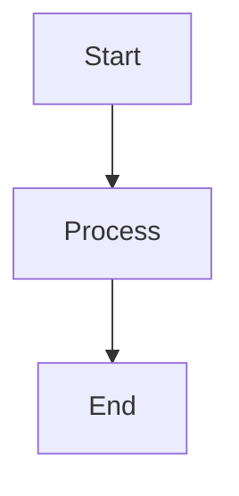

# FlowPilot Documentation

Official documentation site for **FlowPilot** - Your AI-powered coding companion for VS Code.

This site is built using [Docusaurus](https://docusaurus.io/), a modern static website generator optimized for documentation.

## 🚀 Quick Start

### Installation

```bash
buninstall
```

### Local Development

```bash
bunstart
```

This command starts a local development server and opens up a browser window at `http://localhost:3000`. Most changes are reflected live without having to restart the server.

### Build

```bash
bunrun build
```

This command generates static content into the `build` directory and can be served using any static hosting service (Vercel, Netlify, GitHub Pages, etc.).

---

## 📁 Project Structure

```
flowpilot-docs/
├── docs/                    # Documentation pages
│   ├── intro.md            # Landing page
│   ├── getting-started.md  # Developer setup guide
│   ├── features.md         # Feature deep dive
│   ├── architecture.md     # System architecture (C4 diagrams)
│   └── faq.md              # Frequently asked questions
├── blog/                    # Blog posts (optional)
├── src/                     # Custom React components
│   ├── css/                # Custom CSS
│   └── pages/              # Custom pages
├── static/                  # Static assets (images, fonts)
├── docusaurus.config.ts    # Site configuration
└── sidebars.ts             # Sidebar navigation
```

---

## ✏️ Contributing to Docs

### Adding a New Page

1. Create a new `.md` or `.mdx` file in the `docs/` directory
2. Add frontmatter at the top:

```markdown
---
sidebar_position: 3
title: Your Page Title
description: A brief description
---

# Your Page Title

Content goes here...
```

3. The page will automatically appear in the sidebar

### Using Mermaid Diagrams

Docusaurus supports Mermaid out of the box. Just use fenced code blocks:

````markdown

````

### Markdown Features

- **Admonitions**: `:::tip`, `:::warning`, `:::danger`
- **Code Blocks**: Syntax highlighting for 100+ languages
- **Tabs**: Group related content
- **MDX**: Use React components in Markdown

See the [Docusaurus Markdown Features](https://docusaurus.io/docs/markdown-features) guide for more.

---

## 🌐 Deployment

### Vercel (Recommended)

1. Push to GitHub
2. Import project in Vercel
3. Deploy automatically on every push

### GitHub Pages

```bash
GIT_USER=<Your GitHub username> bunrun deploy
```

This builds the site and pushes to the `gh-pages` branch.

---

## 🔗 Links

- **Live Docs**: [https://docs.flowpilot.ai](https://docs.flowpilot.ai) *(coming soon)*
- **Main Repo**: [flowpilot-vscode-extension](../flowpilot-vscode-extension)
- **Web Dashboard**: [apps/web](../apps/web)

---

## 📝 License

MIT License - see the [LICENSE](../LICENSE) file for details.
