# 🏗️ Architecture Overview

This document provides a comprehensive view of FlowPilot's architecture using the C4 Model (Context, Container, Component, Code). Understanding these diagrams will help you navigate the codebase and contribute effectively.

---

## Level 1: System Context

The highest-level view showing how FlowPilot fits into the developer's ecosystem.

```mermaid
graph TB
    Developer[("👨‍�💻 Developer<br/>(User)")]
    VSCode["VS Code IDE"]
    FlowPilot["FlowPilot System"]
    LLM["LLM Provider<br/>(OpenRouter/OpenAI)"]
    GitHub["GitHub<br/>(OAuth)"]
    
    Developer -->|Uses| VSCode
    VSCode -->|Runs| FlowPilot
    FlowPilot -->|Queries| LLM
    FlowPilot -->|Authenticates via| GitHub
    
    style FlowPilot fill:#1b5cff,stroke:#154fe0,color:#fff
    style Developer fill:#4caf50,stroke:#45a049,color:#fff
```

**Key Interactions:**
- **Developer** writes code in VS Code and interacts with FlowPilot features
- **FlowPilot** analyzes code and sends requests to LLM providers
- **GitHub OAuth** handles user authentication for the web dashboard

---

## Level 2: Container Diagram

Shows the major containers (applications/services) that make up FlowPilot.

**Container Responsibilities:**

| Container | Technology | Purpose |
|-----------|-----------|---------|
| **FlowPilot Extension** | TypeScript, VS Code API | Code analysis, context extraction, UI rendering |
| **Backend API** | Next.js, tRPC | Request routing, LLM orchestration, session tracking |
| **Web Dashboard** | Next.js, React, TailwindCSS | User analytics, session history, settings |
| **PostgreSQL** | Prisma ORM | User data, sessions, API keys |

---

## Level 3: Component Diagram (Extension)

Detailed view of the VS Code Extension's internal components.

**Component Descriptions:**

### Core Components

- **`extension.ts`**: Entry point, registers all commands and providers
- **`FlowPilotProvider`**: Manages the sidebar webview panel, handles user interactions
- **`CodeActionProvider`**: Provides "Quick Fix" actions for diagnostics

### Context Extraction

- **`getExplainContext()`**: Extracts selected code + surrounding context
- **`getErrorContext()`**: Captures error diagnostics from VS Code

### Analysis Engine

- **`codeAnalyzer.ts`**: Runs linting and security checks
- **`ParserService`**: Uses Tree-sitter for AST parsing (JavaScript, Python, TypeScript)

---

## Level 3: Component Diagram (Backend)

Internal structure of the Next.js backend.

**API Endpoints:**

| Endpoint | Method | Purpose |
|----------|--------|---------|
| `/api/explain` | POST | Stream code explanation |
| `/api/explain-error` | POST | Stream error diagnosis |
| `/api/review-snippet` | POST | Return code review |
| `/api/telemetry` | POST | Log usage events |

---

## Data Flow: "Explain Selection"

Sequence diagram showing the complete flow when a user explains code.

---

## Technology Stack

### Extension
- **Language**: TypeScript
- **Build**: esbuild
- **AST Parsing**: Tree-sitter (JavaScript, Python, TypeScript)
- **HTTP Client**: node-fetch, axios

### Backend
- **Framework**: Next.js 16
- **API**: REST + Server-Sent Events (SSE)
- **ORM**: Prisma
- **Database**: PostgreSQL
- **LLM**: OpenRouter (OpenAI-compatible)

### Web Dashboard
- **Framework**: Next.js 16 (React 19)
- **Styling**: TailwindCSS
- **Auth**: Better-Auth (GitHub OAuth)
- **UI Components**: Radix UI

---

## Deployment Architecture

**Hosting:**
- **Extension**: Distributed via VS Code Marketplace (`.vsix` package)
- **Web + API**: Deployed on Vercel (serverless functions)
- **Database**: Neon (serverless PostgreSQL)

---

## Security Considerations

1. **API Keys**: Stored in VS Code's `SecretStorage` API (encrypted)
2. **HTTPS Only**: All backend communication over TLS
3. **Rate Limiting**: Implemented at API layer (Redis/Upstash)
4. **Code Privacy**: Code snippets sent to LLM are not stored or used for training
5. **Authentication**: JWT tokens with short expiry for dashboard sessions

---

## Next Steps

- [API Reference](./api-reference.md) - Detailed endpoint documentation
- [Contributing Guide](./contributing.md) - How to contribute to the codebase
- [Getting Started](./getting-started.md) - Set up your dev environment
